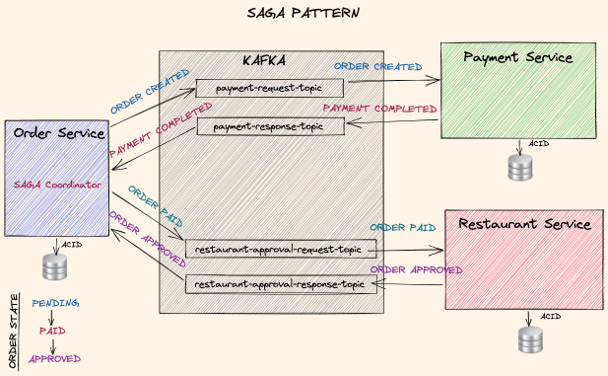

### Lec62. Introduction to SAGA Pattern

> 최대한 강의 원문 스크립트 해석을 직역하되 필요한 부분에 대해 이해를 빠르게 하기 위한 부분은 나름의 의역 및 요약 작업을 수행함.

 

SAGA 패턴을 소개하겠습니다. 

SAGA는 서비스 전반에 걸쳐 분산된 장기 실행 트랜잭션에 사용됩니다. 이러한 거래는 장기간 지속되는 거래입니다. 

SAGA 패턴은 1987년 출판물에서 발명되었습니다. 

SAGA의 기본 아이디어는 서비스 전반에 걸쳐 장기 실행되는 트랜잭션을 마무리하기 위해 local asset 트랜잭션 체인을 생성하는 것입니다. 

 

우리가 실습할 예제에서는 주문 결제 및 레스토랑 서비스 전반에 걸쳐 분산 트랜잭션을 수행하는 데에 SAGA 패턴을 사용할 것입니다.  

음식 주문을 완료하려면 애플리케이션은 결제 완료와 레스토랑 승인이 필요합니다. 

이 시나리오에서는 Kafka를 이벤트 패스로 사용하는 SAGA 패턴을 사용하고 서비스가 입벤트를 사용하여 통신할 수 있도록 합니다. 이러한 이벤트는 안무 접근(choreography approch ) 방식이라고 부릅니다.

 

저는 SAGA 패턴을 조정하기 위해 order service 를 계속 사용할 것입니다. (이전 강의에서 만들어둔 order service를 사용하겠다는 이야기)

 

여기서는 주문 프로세스의 데이터 흐름에 대한 높은 수준의 개요를 볼 수 있습니다.

보시다시피 주문 서비스(order service) 는 SAGA 흐름의 코디네이터 역할을 합니다. 'order created' 이벤트를 결제 서비스(payment service)에 전송하기 때문입니다.

 

**Order Service → `order created` 이벤트→ Payment Service** 

- Order Service 내의 데이터베이스에는 Pending Order 를 표시한다. (강의 대본은 애매한 설명)

`order created` 이벤트를 결제 서비스(payment service)에 전송하는 이 시점에는 주문 서비스(order service) 의 로컬 데이터베이스는 pending order (보류 중인 주문) 을 표시합니다.

 

**Payment Service → `payment completed` 이벤트 → Order Service**

- Order Service 는 Payment Service 로부터 `payment completed` 메시지를 받고나서 Order Service 의 로컬 데이터베이스에 order status 를 `paid` 로 설정한다.

 

**Order Service (`order paid` 메시지) →  `order approval` 이벤트 → Restaurant Service**

- 그리고 나서 `order paid` 이벤트를 이용해서  restaurant service (레스토랑 서비스)에 주문승인 (`order approval`) 요청을 합니다.
- = Order Service 내에서 Order Paid 이벤트가 발생하면, Order Paid 이벤트리스너에서 Order Approval 이벤트를 발생시킨다.

 

**Restaurant Service → `order approval` 이벤트 → Order Service → 로컬 DB 내 주문 상태를 `order approval 로 업데이트`** 

- 주문 서비스는 주문 승인 이벤트를 받으면 최종적으로 로컬 데이터베이스에 승인된 상태로 주문을 완료합니다. 
- 이 시점에서 get 엔드포인트를 사용하여 쿼리하면 클라이언트에 승인된 상태가 반환됩니다.

 

이후의 기타 프로세스들의 흐름

- 그 후 클라이언트는 배송 프로세스와 같은 다음 단계를 시작할 수 있습니다.

 

그래서 저는 이 흐름을 따르고 각 단계에서 구현될 프로세스 및 롤백 방법과 함께 SAGA 단계 인터페이스를 사용할 것입니다.

각 SAGA 단계에는 두 가지 방법의 프로세스와 롤백이 필요합니다. 왜냐하면 실패할 경우 언제든지 이전 작업을 SAGA 패턴으로 보상해야 하기 때문입니다.

따라서 이는 각 SAGA 단계의 롤백 방법을 사용하여 달성됩니다.

좋습니다. 다음 강의에서는 주문 서비스를 업데이트하겠습니다.

결제 및 레스토랑 승인을 위한 SAGA 단계를 이용하세요.

다음 강의에서 뵙겠습니다. 

 

### 강의 스크립트

Let's make an introduction to SAGA Pattern.

SAGA is used for distributed long running transactions across services.
These transactions are long lived transactions.

The SAGA pattern is invented in a publication on 1987,

The idea behind SAGA is to create a chain of local asset transactions to finalize a long running transaction across services.

We will use SAGA Pattern to accomplish a distributed transaction across the order payments and restaurant services.

To complete a food order the application will need to have a successful payment as well as a restaurant approval.

For this scenario, I use SAGA Pattern using Kafka as the event pass and to let the services communicate using events with choreography approach.

I will still use the order service to coordinate the SAGA pattern.

As you will see in the next lecture.

Here you see the high level overview of the data flow on an order process.

As you see, the order service acts as a coordinator for the SAGA flow because it initiates the SAGA by sending the order created events to payment service.

At this point, the local database of order service shows a pending order.

Then it gets the payment completed advance from the payment service and sets the order status as paid in the order service local database, and then asks for order approval to restaurant service using the 'order paid' event.

When order service gets order approved event, it finally completes the order with approved state in its local database. At that point, it'll return the approved state to the clients when it is queried using the get endpoint.

And after that, the client can trigger the next steps such as the delivery process.

So I will follow this flow and use SAGA step interface with process and rollback methods that will be implemented by each step.

Each SAGA step will require the two methods process and rollback because in case of failure, at any point previous operations need to be compensated in SAGA pattern.

So this will be achieved using the rollback methods in each SAGA step.

Great, In the next lecture, I will update the order service

with the SAGA steps for payments and restaurant approval.

I will see you in the next lecture.