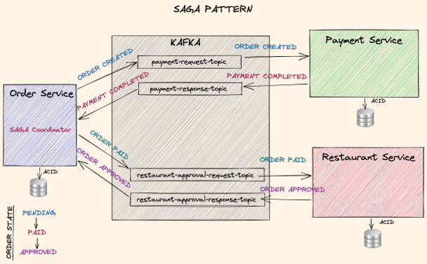

### Lec63. Implementing Order Payment Saga

> 최대한 강의 원문 스크립트 해석을 직역하되 필요한 부분에 대해 이해를 빠르게 하기 위한 부분은 나름의 의역 및 요약 작업을 수행함.

<br>


안녕하세요 여러분.

이번 강의에서는 주문 서비스(Order Service)를 업데이트하고 payment, approval 이라는 Saga Step 들을 추가하겠습니다.<br>

먼저 infrastructure 모듈로 이동하여 saga라는 새 모듈을 만듭니다. 이 infrastructure 모듈에는 두 개의 SAGA Step 인터페이스를 넣을 것입니다. pom.xml에서는  `common-domain` 종속성을 허용하겠습니다.<br>
왜냐하면 `common-domain`의 도메인 이벤트 인터페이스를 사용해야 하기 때문입니다.<br>

<br>


#### **SagaStep 인터페이스 정의**<br>

그런 다음 com.food.ordering.system 패키지를 saga 모듈 내의 /src/main/java 에 만듭니다. 그리고 `SagaStep` 라는 이름으로 `interface` 를 추가합니다.

```java
package com.food.ordering.system.saga;

import com.food.ordering.system.domain.event.DomainEvent;

public interface SagaStep<T, S extends DomainEvent, U extends DomainEvent> {
    S process(T data);
    U rollback(T data);
}
```

여기서는 세 가지 제너릭 변수 T, `S extends DomainEvent` `U extends DomainEvent` 를 사용하도록 해주었습니다.

그리고 두 가지 메서드를 만듭니다.

- process (T data) : S
  - T 타입의 파라미터 data 를 받아서 DomainEvent 타입 S 를 리턴합니다.
- rollback(T data): U
  - 롤백 메서드 입니다.
  - T 타입의 파라미터 data 를 받아서 DomainEvent 타입 U를 리턴합니다.

<br>


 이 인터페이스는 각 Saga 단계로 구현되며 `process(T data)` 메서드는 트랜잭션으로 표준 처리를 처리하고 `rollback(T data)` 메서드는 다음 Saga 단계에서 오류가 발생할 경우 보상 트랜잭션을 처리합니다.

핵심 아이디어는 `다음 단계(Stage)가 실패한다면, 이전 단계가 변경사항을 롤백할 수 있어야 한다` 입니다. 


##### EmptyEvent 구현, Void 타입의 반환

**`Void` 타입의 반환**

SagaStep 의 메서드 들인 porcess(T data), rollback(T data) 를 자세히 보면 각 SAGA 단계는 T 타입을 처리하고 DomainEvent 를 반환한다. 그런데 일부 SAGA Step 에서는 종료 작업일 경우 이벤트를 실행할 필요가 없는 경우가 있다. 


이런 케이스를 처리하기 위해 common-domain 모듈의 event 패키지에 `EmptyEvent`를 생성하겠습니다.

`:common:common-domain/src/main/java/com.food.ordering.system.event.EmptyEvent.java`

```java
package com.food.ordering.system.domain.event;

public final class EmptyEvent implements DomainEvent<Void> {

    public static final EmptyEvent INSTANCE = new EmptyEvent();

    private EmptyEvent() {
    }

    @Override
    public void fire() {

    }
}
```


여기서는 `<Void>` 제너릭 타입으로 DomainEvent 를 구현하겠습니다. 그리고  IDE에 의해 오버라이딩 된 fire 메서드는 빈 블록으로 둡니다.

`public static final EmptyEvent INSTANCE = new EmptyEvent();`

여기에서는 이 클래스에 대한 싱글턴 인스턴스를 전역 인스턴스 상수로 생성하겠습니다. 그리고 `EmptyEvent` 클래스를 `final` 로 선언합니다.

또한 여기서는 private 생성자를 허용하겠습니다. 왜냐하면 이 EmptyEvent 클래스는 단지 마커 클래스일 뿐이고 다른 클래스 간에 동일한 인스턴스를 공유해도 괜찮기 때문입니다.

<br>


**pom.xml**

이제 프로젝트의 최상위에 있는 pom.xml 파일에 saga 종속성을 추가해준다.

```xml
<dependencyManagement>
  <dependencies>
    <dependency>
      <groupId>com.food.ordering.system</groupId>
      <artifactId>saga</artifactId>
      <version>${project.version}</version>
    </dependency>
  </dependencies>
</dependencyManagement>
```

<br>


이번에는 `:order-service:order-domain:order-application-service/pom.xml` 을 열고 버전을 정의없이 saga 모듈 종속성을 추가한다.

```xml 
<dependencies>
  <dependency>
    <groupId>com.food.ordering.system</groupId>
    <artifactId>saga</artifactId>
  </dependency>
</dependencies>
```

<br>


#### **SAGA Step 을 왜 `:order-service:order-domain:order-application-service` 모듈 내에 정의할까?**

좋습니다. 이제 `:order-service:order-domain:order-application-service` 모듈 내에 첫번째 SAGA Step 을 만들어보겠습니다. 

왜 `:order-service:order-domain:order-application-service` 에서 첫번째 SAGA Step 을 생성할까요?

왜냐하면 Order Service 를 SAGA 흐름의 coordinator(코디네이터로) 사용하고 있기도 하고, 모든 SAGA Step 을 Order Service 내에 유지해두고 싶기 때문입니다. (Order Service가 SAGA 의 지휘자처럼 사용되는 역할이기에 가급적 SagaStep 관련 구현들을 Order Service 내에 모아두고 싶다는 이야기.)

<br>


#### **OrderPaymentSaga 구현**

그래서 `:order-service:order-domain:order-application-service` 모듈 내에  OrderPaymentSaga 라는 새 클래스를 만들겠습니다. @Slf4j, @Component 어노테이션을 추가해줬습니다. @Component 어노테이션을 사용함으로써 `OrderPaymentSaga` 를 스프링 매니지드 빈으로 선언했습니다.


#### process(), rollback() 구현

```java
package com.food.ordering.system.order.service.domain;

// ..

@Slf4j
@Component
public class OrderPaymentSaga implements SagaStep<PaymentResponse, OrderPaidEvent, EmptyEvent> {

    private final OrderDomainService orderDomainService;
    private final OrderRepository orderRepository;
    private final OrderPaidRestaurantRequestMessagePublisher orderPaidRestaurantRequestMessagePublisher;

    public OrderPaymentSaga(OrderDomainService orderDomainService,
                            OrderRepository orderRepository,
                            OrderPaidRestaurantRequestMessagePublisher orderPaidRestaurantRequestMessagePublisher) {
        this.orderDomainService = orderDomainService;
        this.orderRepository = orderRepository;
        this.orderPaidRestaurantRequestMessagePublisher = orderPaidRestaurantRequestMessagePublisher;
    }

    @Override
    @Transactional
    public OrderPaidEvent process(PaymentResponse paymentResponse) {
        log.info("Completing payment for order with id: {}", paymentResponse.getOrderId());
        Order order = findOrder(paymentResponse.getOrderId());
        OrderPaidEvent domainEvent = orderDomainService.payOrder(order, orderPaidRestaurantRequestMessagePublisher);
        orderRepository.save(order);
        log.info("Order with id: {} is paid", order.getId().getValue());
        return domainEvent;
    }

    @Override
    @Transactional
    public EmptyEvent rollback(PaymentResponse paymentResponse) {
        log.info("Cancelling order with id: {}", paymentResponse.getOrderId());
        Order order = findOrder(paymentResponse.getOrderId());
        orderDomainService.cancelOrder(order, paymentResponse.getFailureMessages());
        orderRepository.save(order);
        log.info("Order with id: {} is cancelled", order.getId().getValue());
        return EmptyEvent.INSTANCE;
    }

    private Order findOrder(String orderId) {
        Optional<Order> orderResponse = orderRepository.findById(new OrderId(UUID.fromString(orderId)));
        if (orderResponse.isEmpty()) {
            log.error("Order with id: {} could not be found!", orderId);
            throw new OrderNotFoundException("Order with id " + orderId + " could not be found!");
        }
        return orderResponse.get();
    }
}

```

<br>


이제 주문 결제 Saga 클래스에서 매개변수 T를 제너릭 파라미터로 받는 `SagaStep<T>`  인터페이스를 구현하겠습니다.

`OrderPaymentSaga` 라는 SagaStep 은 Payment Service 에서 응답을 받은 후 호출되기에  PaymentResponse 를 타입 T로 사용하겠습니다. return 타입에 대한 타입은 

PaymentResponseModel 을 `PaymentRespone` 로 설정하고 결제가 완료되면 `OrderPaidEvent` 를 `OrderPaymentSaga` 에서 정의한 `U` 타입역할을 하도록 정해줍니다. (쉽게 설명하면 OrderPaymentSaga 의 입력 이벤트는 PaymentResponse 이고 출력이벤트는 OrderPaidEvent 로 정의하겠다는 의미)<br>




Restaurant Approval 요청은 Order Paid 이벤트에 대해서만 trigger 된다는 사실을 기억하세요. 그래서 여기서는 process 메서드의 반환타입을 Order Paid 이벤트로 설정했습니다. 

rollback 메서드의 경우 EmptyEvent 로 세팅하겠습니다. 왜냐하면 Payment 가 성공하지 못했을 경우일 때  이때는 그저 Order Service를 Rollback 하는 것만 필요하다. 

좋습니다. 모두 이러한 일반 유형을 사용하여 프로세스 및 롤백 메서드를 작성해 보겠습니다. 또한 데이터베이스 트랜잭션을 생성하고 이러한 메서드의 변경 사항을 커밋하려고 하기 때문에 두 메서드 모두에 `@Transactional` 을 넣었습니다.

<br>


#### **7분 20초에서부터 다시.**

그런 다음 `PaymentResponseMessageListener` 입력 클래스에서 Payment Order 사가를 사용하여 작업을 처리하거나 롤백합니다.

잠시 이동을 해야 해서 정리한 부분까지만 커밋 & 푸시

<br>


#### PaymentResponseMessageListener, RestaurantResponseMessageListener

PaymentResponseMessageListener, RestaurantResponseMessageListener 입력 클래스는 `com.food.ordering.system.order.service.domain.ports.input` 부분에 정의해둔 `PaymentResponseMessageListener` 인터페이스를 구현한다는 점을 기억하세요. 

e.g. PaymentResponseMessageListenerImpl.java

```java
package com.food.ordering.system.order.service.domain;

// ...

@Slf4j
@Validated
@Service
public class PaymentResponseMessageListenerImpl implements PaymentResponseMessageListener { // 1)

  private final OrderPaymentSaga orderPaymentSaga;

  // ...
  
  @Override
  public void paymentCompleted(PaymentResponse paymentResponse) {
    OrderPaidEvent domainEvent = orderPaymentSaga.process(paymentResponse);
    log.info("Publishing OrderPaidEvent for order id: {}", paymentResponse.getOrderId());
    domainEvent.fire();
  }

  @Override
  public void paymentCancelled(PaymentResponse paymentResponse) {
    orderPaymentSaga.rollback(paymentResponse);
    log.info("Order is roll backed for order id: {} with failure messages: {}",
             paymentResponse.getOrderId(),
             String.join(FAILURE_MESSAGE_DELIMITER, paymentResponse.getFailureMessages()));
  }
}

```


- `1)` 
  - `PaymentResponseMessageListener` 를 implements 하고 있다.

<br>

그리고 `order-messaging` 모듈에서는 `PaymentResponseMessageListener` 인터페이스를 @KafkaListener 가 적용된 메서드 내에서 사용합니다.

`:order-service:order-messaging/src/main/java/com.food.ordering.system.order.service.messaging.listener.kafka/PaymentResponseKafkaListener.java`

```java
package com.food.ordering.system.order.service.messaging.listener.kafka;

// ...

@Slf4j
@Component
public class PaymentResponseKafkaListener implements KafkaConsumer<PaymentResponseAvroModel> {

    private final PaymentResponseMessageListener paymentResponseMessageListener;
    private final OrderMessagingDataMapper orderMessagingDataMapper;

    public PaymentResponseKafkaListener(PaymentResponseMessageListener paymentResponseMessageListener,
                                        OrderMessagingDataMapper orderMessagingDataMapper) {
        this.paymentResponseMessageListener = paymentResponseMessageListener;
        this.orderMessagingDataMapper = orderMessagingDataMapper;
    }

    @Override
    @KafkaListener(id = "${kafka-consumer-config.payment-consumer-group-id}", topics = "${order-service.payment-response-topic-name}")
    public void receive(@Payload List<PaymentResponseAvroModel> messages,
                        @Header(KafkaHeaders.RECEIVED_MESSAGE_KEY) List<String> keys,
                        @Header(KafkaHeaders.RECEIVED_PARTITION_ID) List<Integer> partitions,
                        @Header(KafkaHeaders.OFFSET) List<Long> offsets) {
        log.info("{} number of payment responses received with keys:{}, partitions:{} and offsets: {}",
                messages.size(),
                keys.toString(),
                partitions.toString(),
                offsets.toString());

        messages.forEach(paymentResponseAvroModel -> {
            if (PaymentStatus.COMPLETED == paymentResponseAvroModel.getPaymentStatus()) {
                log.info("Processing successful payment for order id: {}", paymentResponseAvroModel.getOrderId());
                paymentResponseMessageListener.paymentCompleted(orderMessagingDataMapper
                        .paymentResponseAvroModelToPaymentResponse(paymentResponseAvroModel));
            } else if (PaymentStatus.CANCELLED == paymentResponseAvroModel.getPaymentStatus() ||
                    PaymentStatus.FAILED == paymentResponseAvroModel.getPaymentStatus()) {
                log.info("Processing unsuccessful payment for order id: {}", paymentResponseAvroModel.getOrderId());
                paymentResponseMessageListener.paymentCancelled(orderMessagingDataMapper
                        .paymentResponseAvroModelToPaymentResponse(paymentResponseAvroModel));
            }
        });
    }
}
```


이 클래스에는 `@KafkaListener`가 적용된 `receive()` 메서드가 있으므로 실제로 Kafka 소비자를 생성 및 사용하고 PaymentResponse Kafka 토픽(`${order-service.payment-response-topic-name}`)에서 데이터를 가져온 다음 이 `PaymentResponseMessageListener`인터페이스를 사용하여 모든 replication 으로 보냅니다.


그리고 앞서 언급한 대로 결제 응답 메시지 리스너 입력이 될 도메인 이벤트를 호출자에게 반환하면 간단히 이벤트가 시작됩니다.

이 경우 로컬 데이터베이스 트랜잭션 변경 사항이 이미 커밋됩니다.

### 강의 스크립트

Hi everyone.

In this lecture I will update the order service and add payment and approval saga steps.

First, I will go to infrastructure module and create a new module called saga.

I will put two saga step interface in this infrastructure module.
In the palm exam I'll file off this module, I will let common domain dependency.
Because I will need to use domain event interface from common domain.


Then I will create calm food ordering system saga package, and then create saga step interface.

Here I will let three generic variables T, S extends domain event, and U extends domain event.

And I will create two methods.
First method is process methods which parameter T as the data and process method returns S, which is a domain event.

And the second method is rollback methods.

Again, with T as a parameter and this time I will return U, which is again a domain event. This interface will be implemented with each saga step and process methods will handle the standard processing with a transaction, and roll-back methods will handle the compensating transaction in case a failure occurs in the next saga step.

The idea is that, if the next saga step fails previous one should be able to roll-back its changes.
As you see, each saga step will process a type T and it returns a domain event.

In some saga steps, I will not need to fire an event if it is an ending operation. To handle these cases, I will go and create an empty event in event package in the common domain module.

Here I will simply implement domain events with void generic type. And override the fire methods with an empty quote block.

Here I will create a singleton instance of this class with a global instance constant, and make this class final.

Also I will let a private constructor here, because this empty event is just a marker class and sharing the same instance among different classes is okay.

Now to use saga module as a dependency let's add the saga dependency in the base palm exam file with project version.

Then I will open order application service palm exam file and add saga dependency here without version.

Great, now let's create the first saga step in order application service module.

Why do I create this saga step here in the order application service?
Because I use the order service as the coordinator of Saga ~~law~~  flow and I want to keep all saga steps here in the order service.

So I will create a new class here called Order Payment saga. I will let slf4j annotation to use in logging and @component annotation, so this class will be a sprint managed pin.

Remember that, payment restaurant message listener input class implements the input part payment response message listener. And in order messaging module, I use the payment response message listener interface in the payment response Kafka listener class.

This class has a received methods with Kafka listener annotation, so it actually creates and uses a Kafka consumer and gets the data from payment response Kafka topic, and then send it to all the replication service using this payment response message listener interface.

Then in the payment response message listener input class I will just use the order payment saga to process or roll back to operation.
So let's first finish the order payment saga implementation and I will come back here to do payment response message listener input class and use the order payment saga object to process or roll-back saga operation.

Now in the order payment saga class I will implement saga step interface for the data type which is the replacement for parameter T.

I will use payment response because this step will be called after getting a response from payment service.

After setting payment response model as a data type I will set the return type of process methods as order payment, because when a payment is completed order service will get a payment completed event and the order payment saga should proceed to do next step which is restaurant approval.

Remember that restaurant approval request should be triggered with a order paid event. So that's why I set the return type of the process method as order paid event here.

For the rollback method, I will just set the empty events because if the payment is not successful, I just need to roll back to order service local database operations and the saga of law will stop since I don't have any previous step before the order payment step.

Great, let's all write the process and rollback methods with these generic types. I also put transactional annotation in both methods because I want to create a database transaction and commit the changes in these methods.

And when I return the domain events to the caller which will be the payment response message listener input as I mentioned, I will simply fire the events.

As the local database transaction changes will be already committed in that case.


Now I will create three final fields here:

order domain service, order repository, and order paid restaurant request message publisher.

Let's inject these fields using constructor injection.

Then in the process methods first, I will log an info message.
I will rename the parameter as payment response here, and I will get to order from database using order ID.

For this, I will create and call a private method here find order, with string order ID parameter. I will return an order object.

Here I will need to find by ID methods of order repository and currently I only have find by tracking ID methods as you see, so I will let find by ID methods which order ID parameter to the order repository.

And in the implementation class I will override and implement it.
I will simply call the JPA repository find by ID methods.
And map the response JPA and the object to order domain object using the Mapper class.

Now I will return to the order payment saga and call the find by ID methods.

As the parameter, I will create order ID and use UUID from string methods to create the order ID UUID parameter.

This will return an optional order. If this optional object is empty I will log an error message and throw an order not found exception.

Otherwise, I will simply get the order from the optional object and return. After getting to order object in process methods

I will call order domain service pay order methods and pass the order and order paid message publishers as parameters. This will return an order paid advance and I will update to order with the changes into database using all the repository save methods.

Final, I will log info message and return the order paid domain event.
In the roll-back methods, I will log info message and find to order using the same find order methods that I just created.

Then I will call order domain service, cancel order methods with order and failure messages parameters. As you see this cancel order methods has void return type so I don't get a domain event as a response.

That is fine because with this roll-back methods I don't need an event as there is no previous saga step to be triggered. And because of that, here I have an empty event.

Then I will save the order with changes into database, and log an info message, and then return to empty event here.

Now I will return to payment response message listener input class and inject and use the order payment cycle object.

Let's do that in the next lecture.